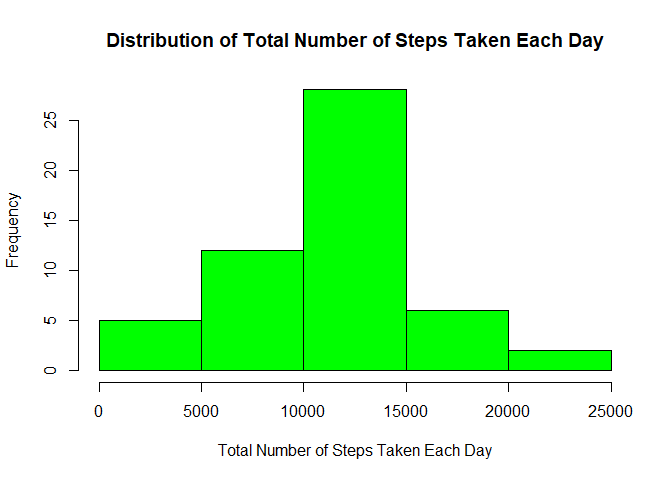
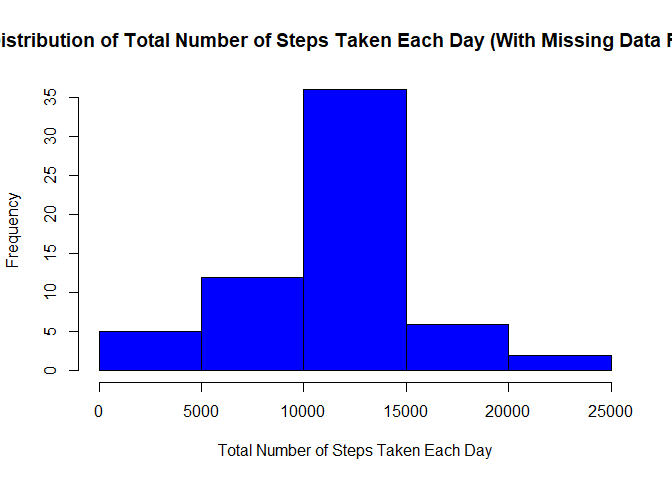
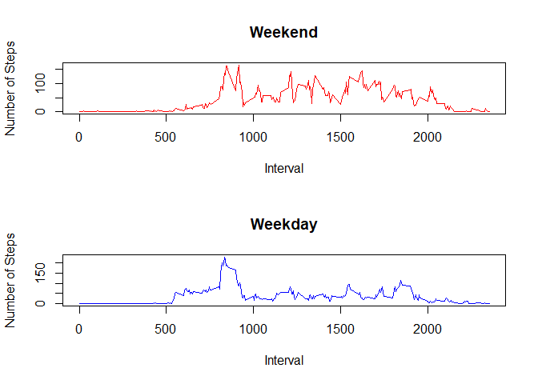

### Introduction

This report seeks to analyse the data from a personal activity
monitoring device. This device collects data at 5 minute intervals
through out the day. The data consists of two months of data from an
anonymous individual collected during the months of October and
November, 2012 and include the number of steps taken in 5 minute
intervals each day.

The data is first loaded into R using the read.csv() function.

    df = read.csv("C:/Users/WeiJie/Desktop/activity.csv", header = T)

### Total Number of Steps Taken Per Day

Firstly, we would like to understand the distribution of the total
number of steps taken each day. To do so, the missing values are first
removed, before grouping the data by date.

    steps = df[!is.na(df$steps),]
    steps = aggregate(steps ~ date, data = steps, sum)

A histogram is then plotted to observe the distribution.

    hist(steps$steps, col = "green", main = "Distribution of Total Number of Steps Taken Each Day", xlab = "Total Number of Steps Taken Each Day")

The mean and median total number of steps taken each day can be obtained
using the mean() and median() functions.

    mean(df$steps, na.rm = T)

    ## [1] 37.3826

    median(df$steps, na.rm = T)

    ## [1] 0

### Average Daily Activity Pattern

Next, we would like to understand the average daily activity pattern per
5-minute interval. The data is first grouped by 5-minute interval.

    pat = df[!is.na(df$steps),]
    pat = aggregate(steps ~ interval, data = pat, mean)

A time series is then plotted.

    plot(pat$interval, pat$steps, type = "l", main = "Average Daily Activity by 5-minute Intervals", xlab = "5-minute Intervals", ylab = "Average Number of Steps Taken")

As seen from the time series, there is an interval that caused a huge
spike in the average number of steps taken. To determine which interval
caused the spike, we may use the following code:

    pat$interval[pat$steps == max(pat$steps)]

    ## [1] 835

### Inputing missing values

We would like to deal with the missing values next. The total number of
missing values are as follows:

    sum(is.na(df$steps))

    ## [1] 2304

We may fill the missing values with the mean for the corresponding
5-minute interval. This is preferred over using the mean or median for
the corresponding day as there is a date (2012-10-01) that does not have
any values and thus we are unable to determine the mean or median for
that day. A new dataset with the missing values filled can be produced
with the following code:

    # Merge original dataset with the steps dataframe in first section
    df = merge(df, pat, by = "interval", all.x = T)

    # Replace all missing values with corresponding mean for that 5-minute interval
    df$steps.x[is.na(df$steps.x)] = df$steps.y[is.na(df$steps.x)]

    # Remove extra column
    df = df[, -ncol(df)]

    # Round number of steps to the nearest integer
    df$steps.x = as.integer(df$steps.x)

We now re-examine the distribution of the total number of steps taken
each day with the new values.

    steps = aggregate(steps.x ~ date, data = df, sum)
    hist(steps$steps, col = "blue", main = "Distribution of Total Number of Steps Taken Each Day (With Missing Data Filled)", xlab = "Total Number of Steps Taken Each Day")

    mean(df$steps)

    ## [1] 37.32559

    median(df$steps)

    ## [1] 0

From the results, it can be seen that the distribution is largely
similar to the first part. The mean and median are also very close.
Hence, the impact of imputing missing data on the estimates of the total
daily number of steps is very minimal.

### Comparing Weekdays and Weekends

Lastly, we would like to compare the activity patterns between weekdays
and weekends. We first need to indicate whether the given dates falls on
a weekday or weekend.

    # Convert date field to "Date" class
    df$date = as.Date(df$date)

    # Add a new column to indicate the day
    df$day = weekdays(df$date)

    # Replace the weekdays with the value "Weekday" and weekends with "Weekend"
    df$day = ifelse(df$day == "Saturday" | df$day == "Sunday", "Weekend", "Weekday")

To compare the time series of weekdays and weekends, time series plots
are plotted for both.

    # Split data by day
    weekend = df[df$day == "Weekend",]
    weekday = df[df$day == "Weekday",]

    # Group each dataframe by 5-minute interval
    weekend = aggregate(steps.x ~ interval, data = weekend, mean)
    weekday = aggregate(steps.x ~ interval, data = weekday, mean)

    # Plot time series plots for both
    par(mfrow = c(2,1))
    plot(weekend$interval, weekend$steps.x, type = "l", col = "red", main = "Weekend", xlab = "Interval", ylab = "Number of Steps")
    plot(weekday$interval, weekday$steps.x, type = "l", col = "blue", main = "Weekday", xlab = "Interval", ylab = "Number of Steps")

